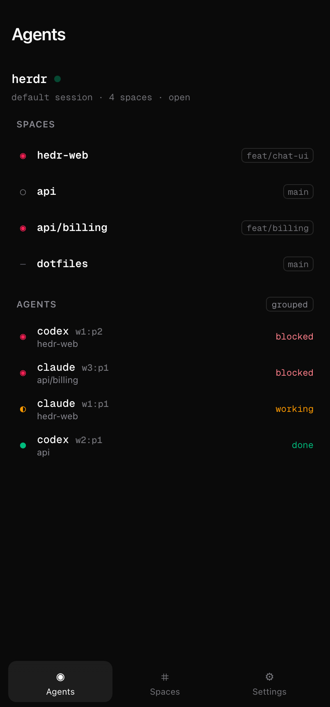
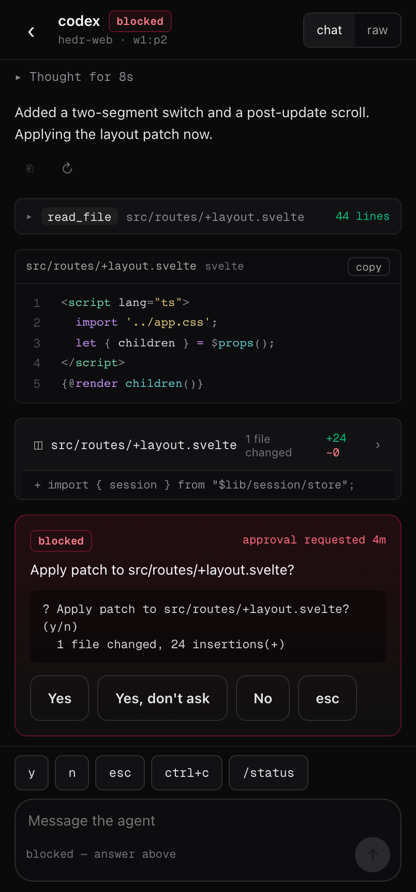
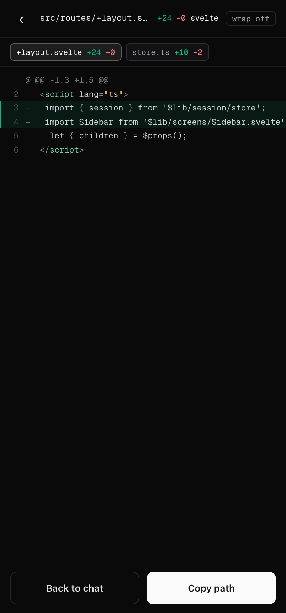
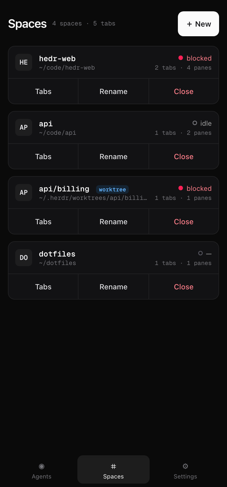
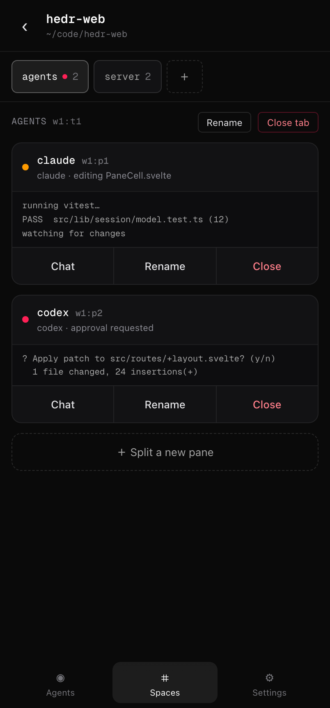
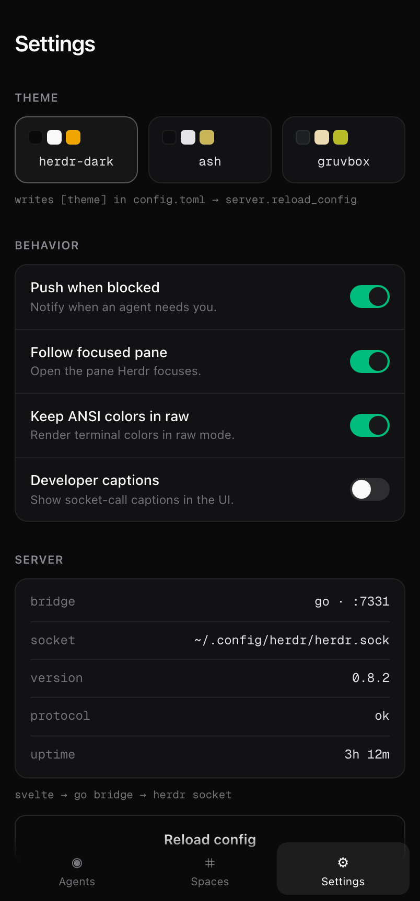
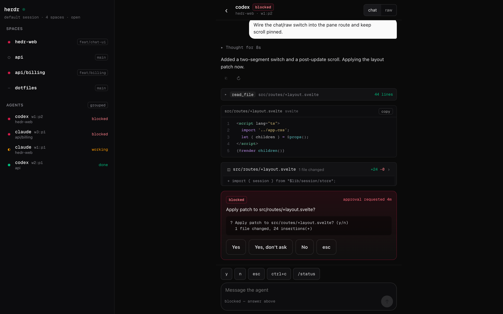

# Herdr Web

A single-operator web client for [Herdr](https://herdr.dev), the terminal/agent
multiplexer. The organizing idea: **agents, not terminals, are the primary
objects.** The default screen is an inbox of every coding agent across your
spaces, sorted so the ones that need you surface first. Raw terminal scrollback
is available but never the default.

It ships as **one self-contained Go binary**: a SvelteKit UI embedded into a Go
bridge that owns a single connection to the Herdr socket
(`~/.config/herdr/herdr.sock`) and fans live session data to the browser.

```
browser (SvelteKit)  ⇄  Go bridge (herdr-bridge)  ⇄  Herdr socket
        WebSocket + embedded static assets, one loopback origin
```

## Screenshots

| Inbox (spaces + agents) | Chat — blocked approval | Diff viewer |
|---|---|---|
|  |  |  |

| Spaces | Space detail | Settings |
|---|---|---|
|  |  |  |

Desktop layout (≥ 880px) — the sidebar *is* the inbox:



> Screenshots are generated with `make screenshots` against the built binary in
> fixtures mode (`?fixtures=1`), which renders the README mock dataset.

## Quick start

```bash
make build      # builds the SvelteKit UI, embeds it, compiles the binary -> bin/herdr-bridge
make run        # build + run the bridge on http://127.0.0.1:7331
```

Open <http://127.0.0.1:7331>. The bridge connects to your running Herdr server
and streams live spaces, tabs, panes, and agent status. Append `?fixtures=1` to
any URL to explore the mocked dataset without a live server.

### Development

```bash
make dev        # SvelteKit dev server (Vite) with HMR, proxying /ws + /api to the bridge on :7331
```

Run the bridge (`make run`) in one pane and `make dev` in another; Vite proxies
the socket traffic so the UI has live data during development.

## Screens

- **Inbox** — mirrors Herdr's own sidebar: a **spaces** section (rollup status
  glyph + label + branch) and an **agents** section (status glyph + name +
  subtitle, with a grouped/flat toggle). Blocked agents sort first. Status is
  carried by glyph shape, colour, and word — never colour alone.
- **Chat** (`/pane/:id`) — the core screen. One component per transcript kind
  (user prompt, reasoning, agent text, tool call, code block, diff summary) and
  the **blocked approval card**, whose Yes / Yes-don't-ask / No / esc buttons send
  `agent.send_keys`. A `chat / raw` switch reveals coloured scrollback via
  `pane.read`. The composer's quick-send chips change when the pane is blocked.
- **Diff viewer** (`/pane/:id/diff`) — unified diff highlighted with Shiki, a
  per-file chip strip, a soft-wrap toggle, and add/remove row tints.
- **Spaces** (`/spaces`) + **space detail** (`/spaces/:id`) — space cards with
  rollup status; detail with a tab strip, pane cards, and add-tab / split-pane
  affordances.
- **Settings** (`/settings`) — theme picker, behaviour toggles, and a read-only
  server card. Writes persist to `config.toml` and call `server.reload_config`.

Every mutating action routes through a confirmation **bottom sheet** first —
nothing mutates on a single tap — and confirming fires a toast.

## Configuration

UI preferences live under a `[web]` table in the Herdr config
(`~/.config/herdr/config.toml`), written by the bridge and applied with
`server.reload_config`:

```toml
[web]
theme = "herdr-dark"   # herdr-dark | ash | gruvbox
notify = true          # push when blocked
follow = true          # follow the focused pane
ansi = true            # keep ANSI colours in raw mode
dev_captions = false   # show socket-call captions (developer setting)
```

The bridge binds to `127.0.0.1:7331` by default (loopback only, no auth —
single operator on localhost). Override with `-addr`, `-socket`, and `-config`.

## Layout

```
cmd/herdr-bridge/       # main: serves UI + /ws + /api, proxies the Herdr socket
internal/protocol/      # canonical Go types + Herdr snapshot -> UI normalization
internal/herdr/         # Herdr socket client (framing, snapshot, event subscribe, reconnect)
internal/config/        # config.toml [web] read/write
internal/server/        # hub: one Herdr connection, WS fan-out, periodic re-snapshot
internal/webui/         # go:embed of the built SvelteKit assets
web/                    # SvelteKit + TypeScript front end
docs/design/            # original design references (spec + HTML prototypes)
```

The web `protocol` types (`web/src/lib/protocol`) mirror the Go structs in
`internal/protocol`, which are canonical.

## Testing

```bash
make test       # Go unit tests + web unit tests (Vitest)
make lint       # go vet + svelte-check
cd web && npm run test:e2e   # Playwright e2e (routes, breakpoint, sheet flows)
```

## Releases

Cross-compiled, self-contained binaries are cut with
[GoReleaser](https://goreleaser.com):

```bash
make snapshot   # local release build (no publish)
make release    # tagged release
```

## Credits

Built to the design handoff in [`docs/design/`](docs/design/DESIGN.md). Herdr
socket API: <https://herdr.dev/docs/socket-api/>.
