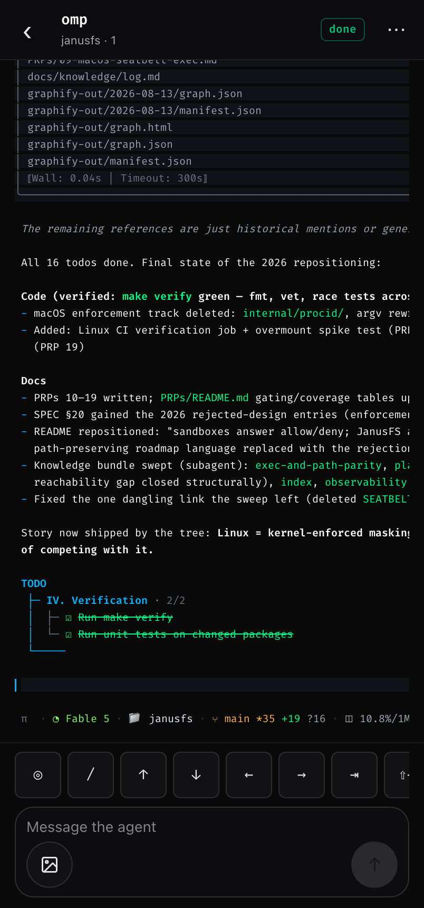
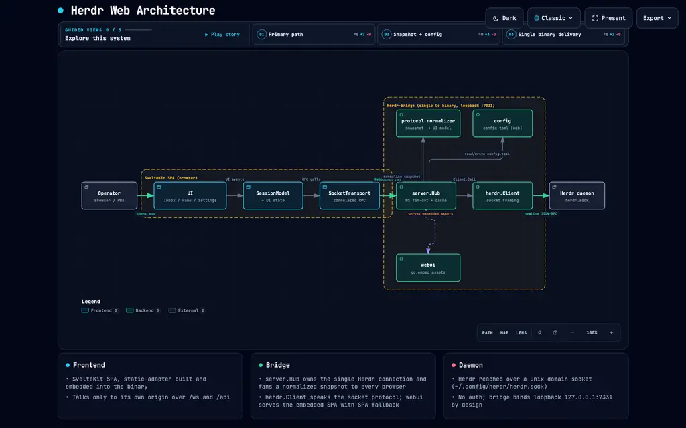

<div align="center">


# Herdr Web

**Your coding agents, in one inbox — on any device.**

[](https://github.com/sarathsp06/herdrweb/releases)
[](go.mod)
[](#install)
[](https://opensource.org/license/mit)

[Install](#install) · [Screens](#screens) · [Mobile](#mobile) · [Contributing](#contributing)

</div>

A single-operator web client for [Herdr](https://herdr.dev), the terminal/agent
multiplexer. The organizing idea: **agents, not terminals, are the primary
objects.** The default screen is an inbox of every coding agent across your
spaces, sorted so the ones that need you surface first; raw terminal scrollback
is one tap away but never the default.

It ships as **one self-contained Go binary** — a SvelteKit UI embedded into a Go
bridge that owns a single connection to the Herdr socket
(`~/.config/herdr/herdr.sock`) and fans live session data to the browser.

```
browser (SvelteKit)  ⇄  Go bridge (herdr-bridge)  ⇄  Herdr socket
        WebSocket + embedded static assets, one loopback origin
```

## Features

- **Agent inbox first** — every agent across your spaces, blocked ones on top; status shown by glyph, colour, and word.
- **Raw terminal panes** — exact scrollback via `pane.read`, auto-fit to any phone width, with a key row and a composer; agent panes take image attach + clipboard-image paste.
- **Installable PWA + push** — add to home screen and get a Web Push when an agent blocks or finishes, even with the app closed.
- **One binary, zero deps** — the UI is embedded; drop `herdr-bridge` on a machine and run it.
- **Live & multiplexed** — one Herdr connection fanned to every browser over a thin WebSocket pass-through.

## Why not SSH, or [`herdr-web`](https://github.com/kcosr/herdr-web)?

**This app is good for:** the 95% of agent-babysitting that's actually just text — reading
scrollback, answering "yes/no", nudging it with a prompt. It's not a toy or a demo: one Go
binary, one persistent connection to the Herdr socket, real RPCs (`pane.read`, `agent.prompt`,
`agent.send_keys`) straight over a WebSocket — no screen-scraping, no terminal emulator pretending
to be a web page. Stable enough that it's my only interface to Herdr, daily, from my phone.

**SSH ([JuiceSSH](https://juicessh.com/), you know who you are)** is what I used first, because
it's what you're supposed to use. Real terminal, works everywhere, very grown-up. Except my
thumbs are built for tapping "like" buttons, not `Ctrl` chords, and a phone keyboard turns `tmux`
into a tiny rage simulator. Great tool. Terrible pair with sausage fingers.

**[`kcosr/herdr-web`](https://github.com/kcosr/herdr-web)** covers the other 5%: an actual
full-blown terminal in your browser (Ghostty, WASM) — vim, htop, multi-host, uploads, the works.
Genuinely impressive, and the right tool if you need a real TUI. This app isn't trying to be that.

So: need a real terminal? SSH or `herdr-web`. Just need to know your agent is stuck and tap a
button about it, reliably, from your phone? That's this.

**Reach for something else when you need:**

- A full terminal — vim, htop, interactive TUIs
- A chat or transcript view — live panes are raw terminal only
- Arbitrary file transfers, multi-host SSH, or a WASM terminal

# Using Herdr Web

## Install

```bash
curl -fsSL https://raw.githubusercontent.com/sarathsp06/herdrweb/main/install.sh | sh
```

Then run the bridge (loopback only by default):

```bash
herdr-bridge        # serves http://127.0.0.1:7331
```

Or run as a background daemon with logging:

```bash
herdr-bridge -daemon -log-file ~/.config/herdr/herdr-bridge.log -pid-file ~/.config/herdr/herdr-bridge.pid
```

Or install and manage it as a system daemon (systemd on Linux, launchd on macOS):

```bash
herdr-bridge -service install    # installs user systemd unit or launchd plist
herdr-bridge -service start      # starts the background service
herdr-bridge -service status     # checks service status
herdr-bridge -service stop       # stops the background service
```

Open <http://127.0.0.1:7331>. The bridge connects to your running Herdr server
and streams live spaces, tabs, panes, and agent status. To use it from your
**phone**, see [Mobile](#mobile).

> [!TIP]
> Append `?fixtures=1` to any URL to explore the mocked dataset without a live
> Herdr server.

## Screenshots

| Inbox (agents + spaces) | Spaces | Space detail |
|---|---|---|
|  |  |  |

| Raw terminal pane | Settings |
|---|---|
|  |  |

Desktop layout (≥ 880px) — the sidebar *is* the inbox:


> Captured against a live bridge (`make run`) with `make screenshots`.

## Screens

- **Inbox** — mirrors Herdr's own sidebar: a **spaces** section (rollup status
  glyph + label + branch) and an **agents** section (status glyph + name +
  subtitle, with a grouped/flat toggle). Blocked agents sort first. Status is
  carried by glyph shape, colour, and word — never colour alone.
- **Pane** (`/pane/:id`) — the core screen: raw terminal scrollback via
  `pane.read`, auto-fit to the viewport width (a box diagram keeps its columns
  on any phone) and follow-on-new-output. The composer routes by pane kind —
  agent panes use `agent.prompt` + `agent.send_keys`, plain terminals use
  `pane.send_text` + `pane.send_keys` — above a key row
  (↑ ↓ ← → ⇥ ⇧⇥ ⏎ esc ⌃C ⌃D). On agent panes, typing `/` opens a
  slash-command palette (↑/↓ to select, Tab/Enter to fill the draft, Esc to
  dismiss), and an image can be attached (button) or pasted from the clipboard
  — the bridge writes it host-side and drops the file path into the draft.
  Everything only edits the draft; sending stays a deliberate act.
- **Diff viewer** (`/pane/:id/diff`) — unified diff highlighted with Shiki, a
  per-file chip strip, a soft-wrap toggle, and add/remove row tints.
- **Spaces** (`/spaces`) + **space detail** (`/spaces/:id`) — space cards with
  rollup status; detail with a tab strip, pane cards, and add-tab / split-pane
  affordances.
- **Settings** (`/settings`) — theme picker (herdr-dark / ash / gruvbox /
  solarized-light), UI text size, phone nav-button placement, and behaviour
  toggles (push-when-blocked, follow focused pane, keep ANSI in raw, developer
  captions). Writes persist to `config.toml` and call `server.reload_config`.

Every mutating action routes through a confirmation **bottom sheet** first —
nothing mutates on a single tap — and confirming fires a toast.

## Mobile

The UI is an installable PWA — on a phone, **Add to Home Screen** to launch it
standalone. Push alerts (an agent needs you, even with the app closed) require a
**secure context**, so the bridge has to be reached over HTTPS.

The easy option is [Tailscale](https://tailscale.com): put both devices on the
tailnet, then front the loopback bridge with a cert —

```bash
tailscale serve --bg --https=443 127.0.0.1:7331
```

Open `https://<machine>.<tailnet>.ts.net` on the phone, install it, and enable
**Settings → Push when blocked** (iOS needs the app installed first). Any other
HTTPS front — a reverse proxy, your own cert — works just as well.

> [!IMPORTANT]
> **No notifications?** Push enrolls **per device**, so enable it on the phone
> itself — not just the desktop. Each device must open the app over **HTTPS**
> (a plain `http://…:7331` is not a secure context and silently refuses to
> subscribe). Use **Settings → Send test notification** to check: it reports how
> many devices are subscribed and whether delivery succeeded, and the bridge log
> prints any rejection reason from the push service.

## Configuration

UI preferences live under a `[web]` table in the Herdr config
(`~/.config/herdr/config.toml`), written by the bridge and applied with
`server.reload_config`:

```toml
[web]
theme = "herdr-dark"   # herdr-dark | ash | gruvbox | solarized-light
notify = true          # push when an agent needs you (blocked, or finished)
follow = true          # follow the focused pane
ansi = true            # keep ANSI colours in raw mode
font_scale = 1.0       # UI text-size multiplier
nav_corner = "bottom-right"  # phone nav button: bottom-right | bottom-left | top
dev_captions = false   # show socket-call captions (developer setting)
```

Flags:
- `-addr` (listen address, default `127.0.0.1:7331`)
- `-socket` (Herdr socket path, default `~/.config/herdr/herdr.sock`)
- `-config` (path to config.toml)
- `-log-file` (path to redirect output logs)
- `-pid-file` (path to write PID file)
- `-daemon` / `-d` (run as background daemon)
- `-service` (manage system service: `install`, `uninstall`, `start`, `stop`, `status`)
- `-version` (print version and exit)

> [!WARNING]
> The bridge has **no authentication** and binds `127.0.0.1:7331` (loopback)
> by design — one operator, one machine. Only expose it over a private network
> such as a [tailnet](#mobile); never bind `0.0.0.0`.

# Contributing

## Build & run from source

```bash
make build      # builds the SvelteKit UI, embeds it, compiles the binary -> bin/herdr-bridge
make run        # build + run the bridge on http://127.0.0.1:7331
```

## Development

```bash
make dev        # SvelteKit dev server (Vite) with HMR, proxying /ws + /api to the bridge on :7331
```

Run the bridge (`make run`) in one pane and `make dev` in another; Vite proxies
the socket traffic so the UI has live data during development.

## Project layout

```
cmd/herdr-bridge/       # main: serves UI + /ws + /api, proxies the Herdr socket
internal/protocol/      # canonical Go types + Herdr snapshot -> UI normalization
internal/herdr/         # Herdr socket client (framing, snapshot, event subscribe, reconnect)
internal/config/        # config.toml [web] read/write
internal/server/        # hub: one Herdr connection, WS fan-out, periodic re-snapshot
internal/webui/         # go:embed of the built SvelteKit assets
web/                    # SvelteKit + TypeScript front end
docs/design/            # original design references (spec + HTML prototypes)
```

The web `protocol` types (`web/src/lib/protocol`) mirror the Go structs in
`internal/protocol`, which are canonical.

## Architecture

[](https://sarathsp06.github.io/herdrweb/diagrams/architecture.html)

[Open the interactive diagram](https://sarathsp06.github.io/herdrweb/diagrams/architecture.html) —
pan/zoom, trace a relationship, switch light/dark, and export to PNG/SVG.

## Testing

```bash
make test       # Go unit tests + web unit tests (Vitest)
make lint       # go vet + svelte-check
cd web && npm run test:e2e   # Playwright e2e (routes, breakpoint, sheet flows)
```

## Releases

Cross-compiled, self-contained binaries (`linux`/`darwin` × `amd64`/`arm64`)
are cut with [GoReleaser](https://goreleaser.com). Pushing a `v*` tag runs the
[release workflow](.github/workflows/release.yml), which builds the binaries and
attaches them (with `checksums.txt`) to the GitHub Release:

```bash
git tag -a v0.1.0 -m "v0.1.0" && git push origin v0.1.0
```

Build locally without publishing:

```bash
make snapshot   # local release build (no publish)
make release    # tagged release (needs a tag)
```

## Credits

Built to the design handoff in [`docs/design/`](docs/design/DESIGN.md). Herdr
socket API: <https://herdr.dev/docs/socket-api/>.
