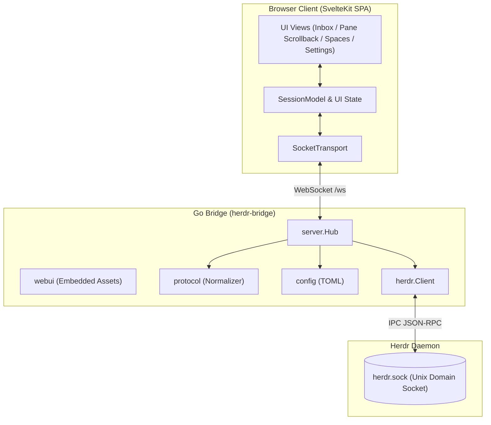
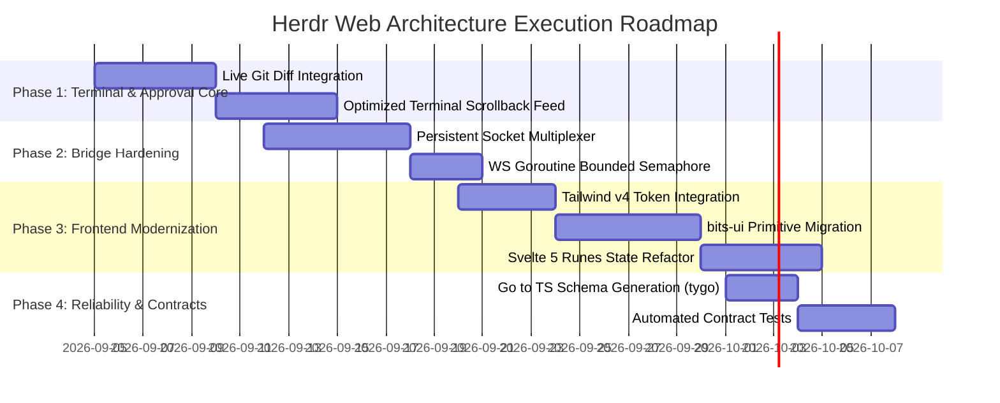

# Herdr Web: Architectural Review & Strategic Recommendations

> **Note on Scope**: This document contains high-level architectural recommendations, design evaluations, and execution roadmaps. No application code has been modified. Furthermore, all references to "transcripts" in this project refer strictly to **text-based terminal scrollback and agent command turns** from CLI tools (e.g., Claude Code, Codex, Aider). There is **no audio/speech-to-text processing** involved or recommended.

---

## 1. Executive Summary & Core Paradigm

[Herdr Web](https://herdr.dev) is a single-operator management interface for the **Herdr** terminal and agent multiplexer. The foundational architectural thesis is:
> **Agents, not terminals, are the primary objects.**

The primary workflow surfaces coding agents that require human attention (status `blocked`) first. High-level commands and approval keybindings (`y`, `a`, `n`, `esc`) are accessible directly from the interface, while raw terminal scrollback (`pane.read`) provides the ground truth.

The architecture is a single self-contained Go binary (`herdr-bridge`) that embeds a compiled SvelteKit SPA, communicates via Unix domain socket with the Herdr daemon (`~/.config/herdr/herdr.sock`), and serves browser clients over HTTP/WebSocket on loopback (`127.0.0.1:7331`).

---

## 2. High-Level Architectural Decisions & Trade-Offs

### 2.1 Single Self-Contained Binary (`go:embed`)
* **Decision**: Pre-compile SvelteKit static assets into `dist/` and embed them into the Go binary tree using `go:embed` in [`webui.go`](file:///Users/sarathsadasivanpillai/projects/herderweb/internal/webui/webui.go#L12).
* **Trade-Off Analysis**:
  * **Pros**: Zero external runtime dependencies for the operator (no Node.js on deployment machines), straightforward cross-compilation with GoReleaser, atomic binary distribution.
  * **Cons**: Coupled build pipeline requiring Node.js during compilation (`make web` must precede `go build`). In development, requires running both the bridge and Vite dev server.

### 2.2 State Synchronization: Coarse Re-Snapshotting vs. Event Sourcing
* **Decision**: In [`server.go`](file:///Users/sarathsadasivanpillai/projects/herderweb/internal/server/server.go#L83), [`Hub.Run`](file:///Users/sarathsadasivanpillai/projects/herderweb/internal/server/server.go#L83) establishes a persistent event subscription to Herdr via [`Client.Subscribe`](file:///Users/sarathsadasivanpillai/projects/herderweb/internal/herdr/client.go#L146) alongside a 1.5-second fallback polling loop. Every event or poll tick invokes [`Hub.markDirty`](file:///Users/sarathsadasivanpillai/projects/herderweb/internal/server/server.go#L146), which debounces for 120ms, pulls a full `session.snapshot`, normalizes it into [`protocol.Snapshot`](file:///Users/sarathsadasivanpillai/projects/herderweb/internal/protocol/protocol.go#L52), and broadcasts the complete JSON graph to all connected WebSockets.
* **Trade-Off Analysis**:
  * **Pros**: Eliminates state drift, event ordering bugs, and complex reconnection synchronization. Reconnects self-heal instantly.
  * **Cons**: The frontend [`SessionModel`](file:///Users/sarathsadasivanpillai/projects/herderweb/web/src/lib/session/model.ts#L21) contains extensive logic for handling granular event types (`workspace.updated`, `tab.updated`, `pane.updated`, `pane.agent_status_changed`, `pane.output_matched`), but the Go backend never forwards these events. Re-serializing the full workspace snapshot on every tick is coarse, though practical for single-operator scale.

### 2.3 IPC Socket Model: Per-Request Dialing vs. Persistent Connection
* **Decision**: In [`client.go`](file:///Users/sarathsadasivanpillai/projects/herderweb/internal/herdr/client.go#L63), [`Client.Call`](file:///Users/sarathsadasivanpillai/projects/herderweb/internal/herdr/client.go#L63) dials a fresh Unix domain socket connection for every single RPC call (`pane.read`, `agent.prompt`, `agent.send_keys`), writes a JSON-RPC line, reads the response, and closes the connection. Only [`Client.Subscribe`](file:///Users/sarathsadasivanpillai/projects/herderweb/internal/herdr/client.go#L146) retains a persistent connection.
* **Trade-Off Analysis**:
  * **Pros**: Simple semantics, matches the Herdr CLI client architecture, completely immune to connection pooling deadlocks or head-of-line blocking.
  * **Cons**: Incurs socket creation/teardown overhead during rapid keyboard interactions ([`Composer.svelte`](file:///Users/sarathsadasivanpillai/projects/herderweb/web/src/lib/chat/Composer.svelte#L35)) or frequent prompt interactions. Because Herdr supports JSON-RPC request correlation via `id`, maintaining a persistent connection or small pool is more efficient.

### 2.4 Agent View Design: Terminal-First vs. Chat Bubble Parser
* **Observation**:
  * The mock prototype included UI components for chat bubbles, reasoning blocks, and tool calls ([`transcripts.ts`](file:///Users/sarathsadasivanpillai/projects/herderweb/web/src/lib/chat/transcripts.ts#L6)).
  * However, against a live Herdr instance, all live agent panes default to raw scrollback mode (`pane.read`) because no structured text-parser or feed exists ([`+page.svelte`](file:///Users/sarathsadasivanpillai/projects/herderweb/web/src/routes/pane/%5Bid%5D/+page.svelte#L32)).
* **Strategic Recommendation**:
  * **Avoid Over-Engineering**: Do not attempt to build a fragile, reverse-engineered LLM chat parser on top of terminal stdout.
  * **Streamline on Terminal Ground Truth**: Focus the core view on high-performance terminal scrollback (`pane.read`) with ANSI color preservation, paired with prominent **Approval / Blocked Cards** (`agent.send_keys`) and the **Prompt Composer** (`agent.prompt`). This delivers 100% of the multiplexer operator utility with zero parser fragility.

### 2.5 Frontend Stack Evolution & Design Token Fidelity
* **Current State**: Custom CSS tokens in [`tokens.css`](file:///Users/sarathsadasivanpillai/projects/herderweb/web/src/lib/tokens.css) define exact OKLCH color gamuts, hairline borders, and Geist typography according to [`DESIGN.md`](file:///Users/sarathsadasivanpillai/projects/herderweb/docs/design/DESIGN.md#L29).
* **Recent Dependencies**: Tailwind v4 (`@tailwindcss/vite`), `bits-ui`, `clsx`, `tailwind-merge`, and `@lucide/svelte` were added in commit `822c8fa`.
* **Trade-Off Analysis**:
  * `bits-ui` provides headless accessible primitives for complex interactions ([`BottomSheet.svelte`](file:///Users/sarathsadasivanpillai/projects/herderweb/web/src/lib/ui/BottomSheet.svelte), [`Toggle.svelte`](file:///Users/sarathsadasivanpillai/projects/herderweb/web/src/lib/ui/Toggle.svelte)).
  * However, migration must preserve the strict high-contrast design system, touch-target thresholds (minimum 44px on mobile), and dark/ash/gruvbox theme palettes without falling back to generic Tailwind presets.

---

## 3. Deep-Dive Component Review & Risk Register

### 3.1 Go Backend (`cmd/`, `internal/`)

| File | Responsibilities | Review & Recommendations |
|---|---|---|
| [`main.go`](file:///Users/sarathsadasivanpillai/projects/herderweb/cmd/herdr-bridge/main.go) | CLI flags, context lifecycle, HTTP server graceful termination. | Clean, idiomatic context propagation using `signal.NotifyContext`. |
| [`client.go`](file:///Users/sarathsadasivanpillai/projects/herderweb/internal/herdr/client.go) | Unix socket IPC, JSON-RPC requests, event subscription streaming. | Dialing per call creates needless I/O churn. Replace with a persistent multiplexed connection with atomic sequence IDs. |
| [`server.go`](file:///Users/sarathsadasivanpillai/projects/herderweb/internal/server/server.go) | Hub manager, WebSocket upgrades, debounced broadcasts, REST endpoints. | 1. In [`handleWS`](file:///Users/sarathsadasivanpillai/projects/herderweb/internal/server/server.go#L246), `go h.handleCall(...)` spawns an unbounded goroutine per incoming WebSocket frame without concurrency throttling. 2. 1.5s ticker is necessary because Herdr does not broadcast global agent status changes. |
| [`protocol.go`](file:///Users/sarathsadasivanpillai/projects/herderweb/internal/protocol/protocol.go) | Canonical Go domain model and Herdr snapshot normalizer. | Well-structured normalizer (`NormalizePane`, status mapping). Requires automated sync with TypeScript to prevent drift. |
| [`config.go`](file:///Users/sarathsadasivanpillai/projects/herderweb/internal/config/config.go) | TOML persistence for `[web]` table in `config.toml`. | Safe atomic writes using temp files and `os.Rename`. Preserves foreign TOML tables. |
| [`webui.go`](file:///Users/sarathsadasivanpillai/projects/herderweb/internal/webui/webui.go) | Embedded filesystem handler with SPA `index.html` fallback. | Correct fallback routing for client-side HTML5 history navigation. |

### 3.2 Frontend Architecture (`web/src/`)

| File | Responsibilities | Review & Recommendations |
|---|---|---|
| [`model.ts`](file:///Users/sarathsadasivanpillai/projects/herderweb/web/src/lib/session/model.ts) | Framework-agnostic in-memory workspace and pane graph. | Pure TypeScript class with unit test coverage. Currently contains unused delta update handlers due to backend snapshot broadcasting. |
| [`store.ts`](file:///Users/sarathsadasivanpillai/projects/herderweb/web/src/lib/session/store.ts) | Bridges [`SessionModel`](file:///Users/sarathsadasivanpillai/projects/herderweb/web/src/lib/session/model.ts#L12) to Svelte readable stores. | Mixes legacy Svelte stores with Svelte 5. Can be refactored into a native Svelte 5 class utilizing `$state` and `$derived`. |
| [`socket.ts`](file:///Users/sarathsadasivanpillai/projects/herderweb/web/src/lib/transport/socket.ts) | WebSocket transport with backoff reconnection and pending call map. | Clean asynchronous Promise correlation via request IDs (`c1`, `c2`). Handles socket disconnect rejection correctly. |
| [`+page.svelte`](file:///Users/sarathsadasivanpillai/projects/herderweb/web/src/routes/pane/%5Bid%5D/+page.svelte) | Core pane view, auto-scrolling, mode switching (`chat` vs `raw`). | Includes bottom-pinned scroll tracking to prevent jumping while reading historical logs. Operates cleanly in terminal scrollback mode. |
| [`Composer.svelte`](file:///Users/sarathsadasivanpillai/projects/herderweb/web/src/lib/chat/Composer.svelte) | Auto-growing textarea, navigation chips, prompt submission. | Implements non-blocking prompt dispatch via `void s.request(...)`. Clean keyboard navigation controls (`up`, `down`, `enter`, `esc`, `ctrl+c`). |
| [`BottomSheet.svelte`](file:///Users/sarathsadasivanpillai/projects/herderweb/web/src/lib/ui/BottomSheet.svelte) | Action confirmation barrier. | Enforces zero accidental destructive actions (spaces/tabs/panes close only after explicit confirmation with spelled-out consequences). |

---

## 4. Phased Implementation Roadmap

### Phase 1: Streamlined Terminal & Approval Integration
1. **Live Diff Provider**:
   * Add a bridge method or Herdr command to fetch actual unified diffs for a workspace/pane (e.g. `git -C <cwd> diff HEAD`).
   * Connect [`diff/+page.svelte`](file:///Users/sarathsadasivanpillai/projects/herderweb/web/src/routes/pane/%5Bid%5D/diff/+page.svelte) to real diff data instead of `FIXTURE_DIFFS`.
2. **Terminal Scrollback Optimization**:
   * Streamline [`pane.read`](file:///Users/sarathsadasivanpillai/projects/herderweb/web/src/routes/pane/%5Bid%5D/+page.svelte#L38) with soft-wrapping and fast ANSI color rendering, keeping terminal scrollback as the reliable live interface.
   * Ensure blocked prompts and approval cards trigger immediately whenever an agent pane's status shifts to `blocked`.

### Phase 2: Bridge Hardening & Socket Multiplexing
1. **Multiplexed IPC Client**:
   * Refactor [`Client`](file:///Users/sarathsadasivanpillai/projects/herderweb/internal/herdr/client.go#L27) to maintain a single persistent duplex connection with a concurrent-safe request map (`map[string]chan response`).
   * Reconnect transparently with exponential backoff on socket drop.
2. **Resource Throttling**:
   * Implement a bounded worker pool (or buffered token channel) in [`Hub.handleWS`](file:///Users/sarathsadasivanpillai/projects/herderweb/internal/server/server.go#L220) to bound in-flight RPC goroutines.

### Phase 3: Frontend Modernization (Tailwind v4 & Svelte 5 Native State)
1. **Design Token Mapping**:
   * Configure Tailwind v4 `@theme` block in CSS to reference the existing OKLCH color palette and font definitions in [`tokens.css`](file:///Users/sarathsadasivanpillai/projects/herderweb/web/src/lib/tokens.css).
   * Ensure dark, ash, and gruvbox CSS themes function identically without class name conflicts.
2. **Headless Component Migration**:
   * Migrate [`BottomSheet.svelte`](file:///Users/sarathsadasivanpillai/projects/herderweb/web/src/lib/ui/BottomSheet.svelte) to `bits-ui` Dialog / Drawer primitives for full keyboard trapping, focus management, and ARIA compliance.
   * Migrate [`Toggle.svelte`](file:///Users/sarathsadasivanpillai/projects/herderweb/web/src/lib/ui/Toggle.svelte) to `bits-ui` Switch primitive.
3. **Runes-First Session Model**:
   * Eliminate Svelte 4 `writable` wrappers in [`store.ts`](file:///Users/sarathsadasivanpillai/projects/herderweb/web/src/lib/session/store.ts).
   * Turn `SessionModel` into a reactive Svelte 5 class utilizing `$state` and `$derived`.

### Phase 4: Reliability, CI & Contract Verification
1. **Automated Protocol Generation**:
   * Use a Go-to-TypeScript type generator (such as `tygo`) in the `Makefile` to generate [`web/src/lib/protocol/index.ts`](file:///Users/sarathsadasivanpillai/projects/herderweb/web/src/lib/protocol/index.ts) directly from [`internal/protocol/protocol.go`](file:///Users/sarathsadasivanpillai/projects/herderweb/internal/protocol/protocol.go).
2. **Contract Testing**:
   * Add automated contract tests ensuring mock payloads in [`fixture.ts`](file:///Users/sarathsadasivanpillai/projects/herderweb/web/src/lib/transport/fixture.ts) adhere strictly to the Go schema definitions.
