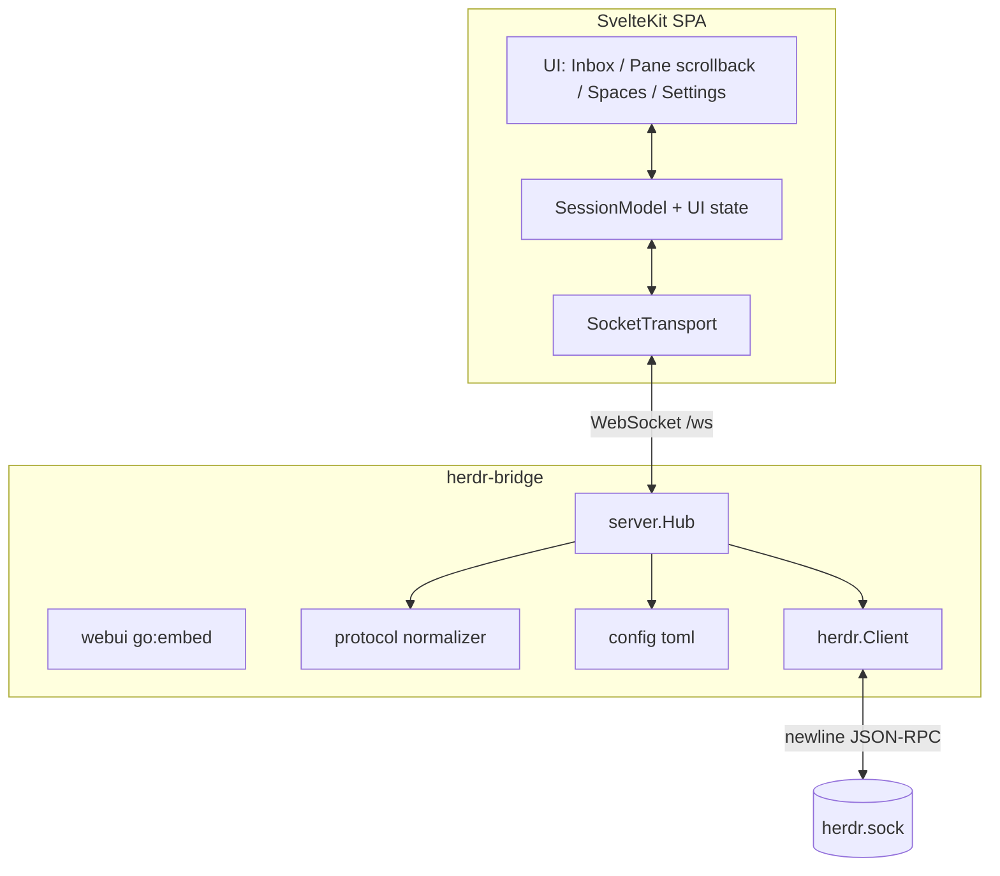

# System Overview

Herdr Web is one self-contained Go binary, `herdr-bridge`, that fronts a running Herdr daemon for a single operator on localhost.

# Tiers

- **Frontend** ([web/src](/frontend/index.md)) — a SvelteKit SPA (static adapter), built and embedded into the binary. Talks only to its own origin over `/ws` + `/api`.
- **Bridge** ([internal/](/packages/index.md)) — [server.Hub](/packages/server.md) owns the Herdr connection, caches a normalized snapshot, and fans it to browsers; [herdr.Client](/packages/herdr.md) speaks the socket protocol; [protocol](/packages/protocol.md) normalizes Herdr's raw snapshot into the UI model; [webui](/packages/webui.md) serves the embedded assets with SPA fallback.
- **Daemon** — Herdr itself, reached over its Unix domain socket (`~/.config/herdr/herdr.sock`).

# Key decisions

- ✎ **Single binary via `go:embed`** — zero runtime deps for the operator; build couples Node (build the SPA) then Go.
- ✎ **Coarse re-snapshotting, not event sourcing** — every Herdr event (or a 1.5s poll tick) marks the cache dirty; a 120ms debounce pulls a full `session.snapshot`, normalizes, and broadcasts. Eliminates state-drift/ordering bugs; see [data flow](/architecture/data-flow.md).
- ✎ **Persistent multiplexed IPC** — [herdr.Client](/packages/herdr.md) keeps one RPC connection with id-correlated waiters (post `bridge-ipc-hardening`); `Subscribe` keeps its own connection.
- ✎ **Bounded WS concurrency** — [server.Hub](/packages/server.md) caps in-flight browser RPC handlers per WebSocket connection.
- ✎ **Terminal-first** — live agent panes render raw scrollback (`pane.read`); there is no chat-transcript parser. See [terminal view](/concepts/terminal-view.md).

# Citations

* [README.md](/README.md)
* [docs/ARCHITECTURE_RECOMMENDATIONS.md](/docs/ARCHITECTURE_RECOMMENDATIONS.md)
* [cmd/herdr-bridge/main.go](/cmd/herdr-bridge/main.go)
